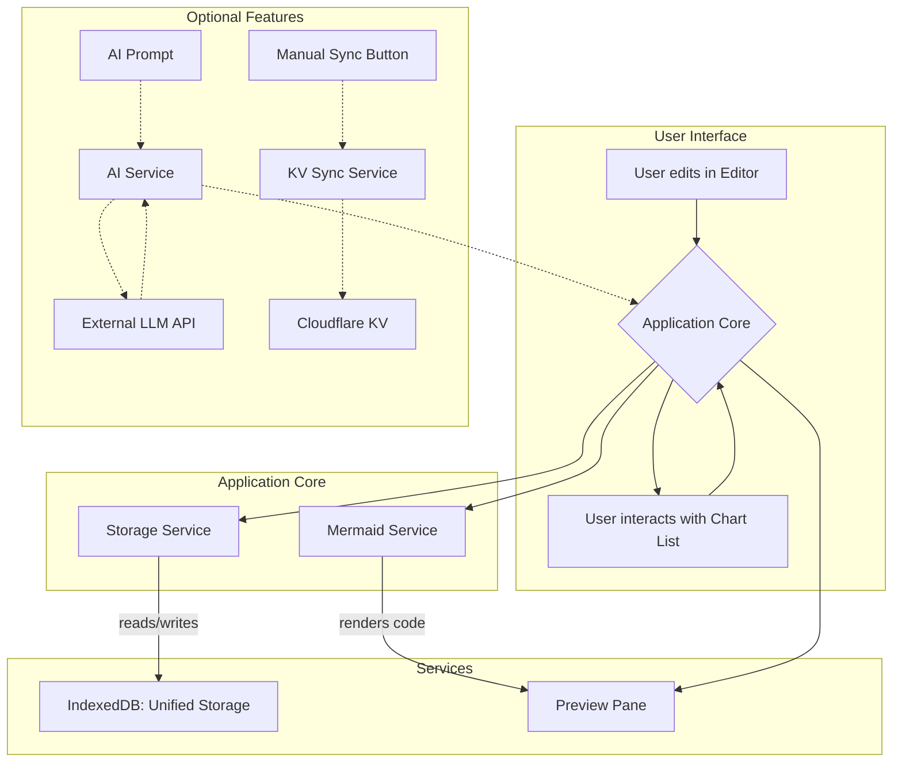

# MermaidEdit Architecture

This document outlines the core architectural decisions for the MermaidEdit project. It serves as a guiding "constitution," not a detailed manual. The code itself should be the ultimate source of truth.

## 1. Core Philosophy

- **Simplicity First**: "If you need more than 3 levels of indentation, you're screwed anyway, and should fix your program." We prefer simple, direct solutions over complex, "theoretically perfect" ones.
- **No Frameworks**: The project will be built with vanilla TypeScript to keep it lightweight, fast, and free of external dependencies' bloat.
- **Progressive Enhancement**: We will build a solid, local-first core product (MVP) and then progressively add complex features like cloud sync. This avoids premature complexity.
- **Code as Documentation**: Clear code, good naming, and a logical structure are valued over extensive external documentation.

## 2. Staged Development Plan

The project is divided into two main stages to manage complexity.

- **Stage 1: MVP (Minimum Viable Product)**
  - **Goal**: Deliver a fully functional, local-only Mermaid editor with AI assistance.
  - **Scope**: All features from the PRD that do not require cloud synchronization. Data is stored exclusively in the browser (`localStorage` and `IndexedDB`).

- **Stage 2: Cloud Synchronization**
  - **Goal**: Introduce optional cloud sync using Cloudflare KV.
  - **Scope**: Add KV configuration, implement a basic manual sync mechanism, and handle simple "last-write-wins" conflict resolution.

## 3. Data Structures

The core data is modeled with two primary interfaces.

```typescript
// Defined in src/types/index.ts

// Unified Storage Structure
interface StorageItem {
  key: string;
  data: UserConfig | ChartData;
  timestamp: number;
}

// Core Data Types
interface UserConfig {
  aiProvider?: 'OpenAI' | 'Anthropic' | 'Custom'; // Optional for MVP
  baseURL?: string;
  apiKey?: string;
  modelName?: string;
  kvStorage?: {
    accountId: string;
    namespaceId: string;
    apiToken: string;
    keyPrefix?: string;
  }
}

interface ChartData {
  id: string; // UUID
  name: string;
  content: string; // Mermaid code
  createdAt: number; // Unix timestamp
  updatedAt: number; // Unix timestamp
  syncStatus: 'local' | 'synced' | 'conflict' | 'error';
}

// Storage Keys Convention
// 'config' -> UserConfig
// 'chart:{uuid}' -> ChartData
```

## 4. Directory Structure

The project follows a feature- and responsibility-driven structure.

```
/
├── dist/
├── public/
│   ├── index.html
│   └── styles.css
├── src/
│   ├── components/   # Self-contained UI modules
│   ├── services/     # Core business logic
│   ├── types/        # Global type definitions
│   ├── utils/        # Shared helper functions
│   └── main.ts       # Application entry point
├── package.json
├── tailwind.config.js
└── tsconfig.json
```

## 5. Simplified Data Flow (MVP)

This diagram illustrates the core data flow focusing on essential functionality.



**Key Simplifications:**
- Unified IndexedDB storage eliminates data duplication
- AI features are optional and don't complicate core flow
- Manual sync prevents race conditions and conflicts
- Clear separation between core and optional features

## 6. Error Handling Architecture

### 6.1 Layered Error Handling

```typescript
// Core error types
type AppError = 
  | StorageError 
  | RenderError 
  | NetworkError 
  | ValidationError;

interface ErrorHandler {
  handle(error: AppError): void;
  recover?(error: AppError): boolean;
}
```

### 6.2 Error Boundaries

**Storage Layer:**
- Catch IndexedDB failures
- Implement retry logic with exponential backoff
- Fallback to memory storage for session

**Render Layer:**
- Isolate Mermaid rendering errors
- Show error overlay without breaking editor
- Provide syntax validation feedback

**Network Layer:**
- Handle offline scenarios gracefully
- Queue failed operations for retry
- Clear user feedback on connection status

### 6.3 Recovery Strategies

**Data Recovery:**
```typescript
class DataRecoveryService {
  async recoverFromStorage(): Promise<ChartData[]>;
  async exportToFile(data: ChartData[]): Promise<void>;
  async importFromFile(file: File): Promise<ChartData[]>;
}
```

**State Recovery:**
- Maintain minimal application state
- Implement state snapshots for critical operations
- Automatic recovery on application restart
