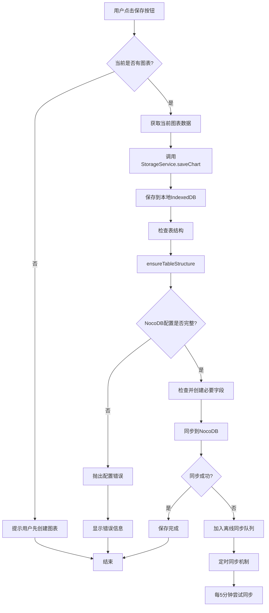
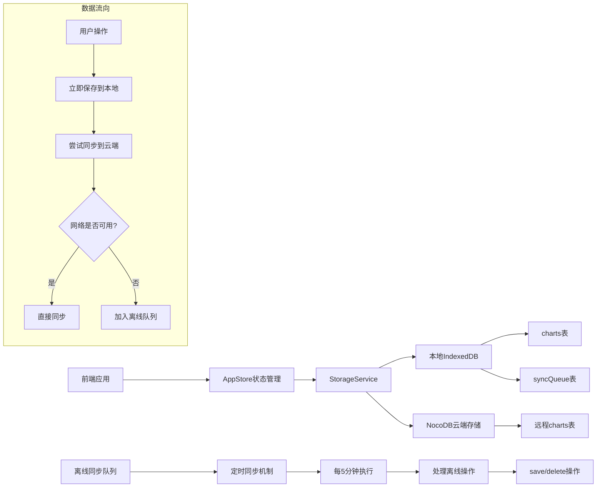
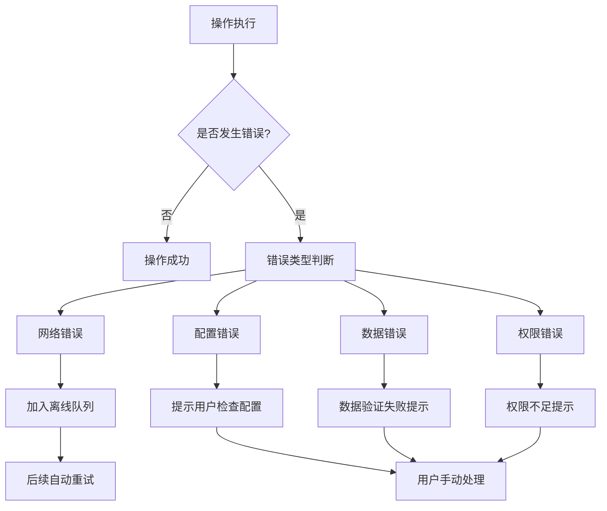
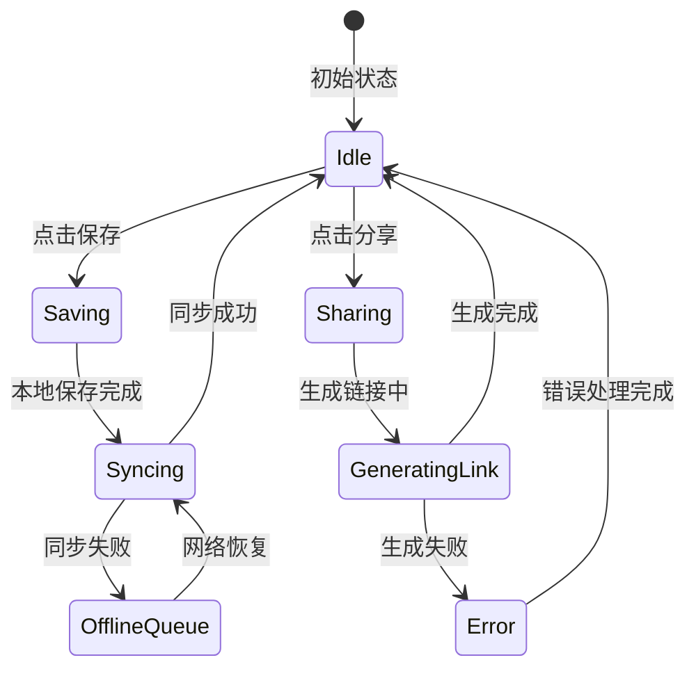

# 保存和分享功能处理逻辑

## 保存功能流程图



## 分享功能流程图

```mermaid
flowchart TD
    A[用户点击分享按钮] --> B{当前图表是否存在且有ID?}
    B -->|否| C[提示"请先保存图表后再分享"]
    B -->|是| D[触发share-chart事件]
    D --> E[创建ShareModal实例]
    E --> F[显示分享模态框]
    F --> G[用户点击"生成并复制链接"]
    G --> H[按钮状态变为"生成中..."]
    H --> I[调用StorageService.getChart]
    I --> J{图表是否存在?}
    J -->|否| K[抛出"图表不存在"错误]
    J -->|是| L[将图表数据JSON序列化]
    L --> M[使用btoa进行Base64编码]
    M --> N[构建分享URL]
    N --> O["${origin}/share.html?data=${encodedData}"]
    O --> P[复制到剪贴板]
    P --> Q{复制成功?}
    Q -->|是| R[按钮显示"已复制"]
    Q -->|否| S[显示复制失败提示]
    R --> T[2秒后恢复按钮状态]
    K --> U[显示错误提示]
    S --> V[恢复按钮状态]
    C --> W[结束]
    T --> W
    U --> W
    V --> W
```

## 数据存储架构



## 关键技术实现

### 保存功能关键点

1. **双重存储策略**
   - 本地IndexedDB：确保数据不丢失
   - NocoDB云端：实现跨设备同步

2. **离线支持**
   - 网络异常时自动加入同步队列
   - 定时重试机制（每5分钟）
   - 冲突解决策略（基于时间戳）

3. **表结构自动管理**
   - 动态检查和创建必要字段
   - 支持数据库结构演进

### 分享功能关键点

1. **数据编码策略**
   - JSON序列化 → Base64编码 → URL编码
   - 确保数据完整性和URL安全性

2. **分享链接格式**
   ```
   https://domain.com/share.html?data=<encoded_chart_data>
   ```

3. **安全性考虑**
   - 只读模式分享
   - 数据在URL中传输（适合小数据量）
   - 无需服务器端存储

## 错误处理机制



## 状态管理

