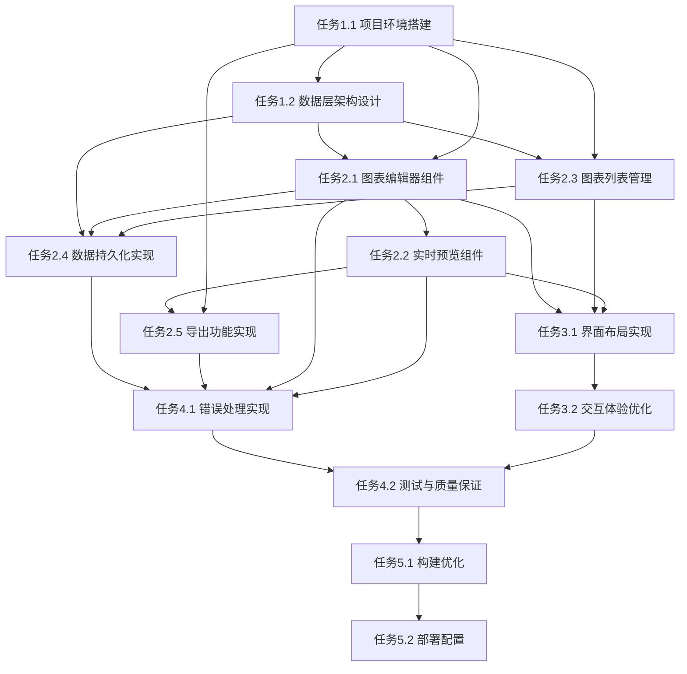

# mermaidEdit 项目任务拆解

## 概述

本文档基于更新后的 PRD.md，详细拆解项目任务，明确每个任务的具体内容、依赖关系、交付成果及验收标准，确保任务分解的全面性、可执行性和可追踪性。

## 项目总体架构

### 技术栈

- **前端框架**：React
- **样式框架**：Tailwind CSS
- **图表渲染**：mermaid.js 最新版本
- **本地存储**：IndexedDB（通过 idb 库）

### 核心功能模块

1. 图表编辑器
2. 实时预览
3. 图表列表管理
4. 数据持久化
5. 导出功能

## 任务分解

### 阶段一：项目初始化与基础架构

#### 任务 1.1：项目环境搭建

**任务描述**：初始化 React 项目，配置开发环境和构建工具

**具体内容**：

- 使用 Vite 创建 React 项目
- 配置 TypeScript 支持
- 安装必要依赖：React、Tailwind CSS、mermaid.js、idb 等
- 配置开发环境（ESLint、Prettier 等）
- 设置项目目录结构

**依赖关系**：无

**交付成果**：

- 可运行的基础项目代码
- 完整的 package.json 配置
- 项目目录结构文档

**验收标准**：

- 项目可以正常启动和运行
- 所有依赖正确安装并配置
- 代码格式化和静态检查工具正常工作

---

#### 任务 1.2：数据层架构设计

**任务描述**：设计并实现数据存储和管理架构

**具体内容**：

- 设计 IndexedDB 数据模型
- 实现数据访问层（DAL）
- 创建图表数据管理服务
- 实现数据持久化逻辑
- 设计数据状态管理方案

**依赖关系**：任务 1.1

**交付成果**：

- 数据模型设计文档
- 数据访问层代码
- 数据管理服务代码
- 数据持久化实现代码

**验收标准**：

- 数据模型符合 PRD 要求
- 可以成功创建、读取、更新、删除图表数据
- 数据持久化功能正常工作
- 数据状态管理可追踪

---

### 阶段二：核心功能开发

#### 任务 2.1：图表编辑器组件

**任务描述**：实现基础的 mermaid 代码编辑器

**具体内容**：

- 创建代码编辑器组件
- 集成代码编辑功能（使用 CodeMirror 或 Monaco Editor）
- 实现代码自动格式化功能
- 添加基本的语法高亮
- 实现编辑器状态管理

**依赖关系**：任务 1.1、任务 1.2

**交付成果**：

- 图表编辑器组件代码
- 编辑器样式文件
- 编辑器状态管理代码
- 单元测试代码

**验收标准**：

- 编辑器可以正常输入和编辑 mermaid 代码
- 代码格式化功能正常工作
- 语法高亮正确显示
- 编辑器状态正确管理

---

#### 任务 2.2：实时预览组件

**任务描述**：实现 mermaid 图表的实时预览功能

**具体内容**：

- 创建实时预览组件
- 集成 mermaid.js 渲染引擎
- 实现实时渲染逻辑
- 添加图表缩放功能（鼠标滚轮 + 按钮控制）
- 实现图表拖拽移动功能
- 添加图表重置视图功能

**依赖关系**：任务 1.1、任务 2.1

**交付成果**：

- 实时预览组件代码
- 预览功能逻辑代码
- 缩放和拖拽交互代码
- 单元测试代码

**验收标准**：

- 输入 mermaid 代码后实时渲染图表
- 图表缩放功能正常工作
- 图表拖拽移动功能正常工作
- 重置视图功能正常工作

---

#### 任务 2.3：图表列表管理

**任务描述**：实现图表列表的展示和管理功能

**具体内容**：

- 创建图表列表组件
- 实现图表数据获取逻辑
- 实现列表展示功能（图表名称、创建时间、更新时间）
- 添加当前选中图表的标识
- 实现点击加载图表功能
- 实现按创建时间倒序排列
- 添加图表名称长度限制（20个字）

**依赖关系**：任务 1.1、任务 1.2

**交付成果**：

- 图表列表组件代码
- 列表管理逻辑代码
- 列表样式文件
- 单元测试代码

**验收标准**：

- 图表列表正确显示所有保存的图表
- 列表按创建时间倒序排列
- 当前选中图表有明确标识
- 点击列表项可以加载对应图表
- 图表名称限制在 20 个字以内

---

#### 任务 2.4：数据持久化实现

**任务描述**：实现图表数据的自动保存功能

**具体内容**：

- 实现自动保存逻辑
- 添加保存状态指示
- 实现新建图表功能
- 实现图表重命名功能
- 实现图表删除功能
- 添加数据备份机制

**依赖关系**：任务 1.2、任务 2.1、任务 2.3

**交付成果**：

- 数据持久化逻辑代码
- 图表管理功能代码
- 保存状态指示组件
- 单元测试代码

**验收标准**：

- 图表编辑后自动保存到本地
- 可以创建新图表
- 可以重命名图表
- 可以删除图表
- 保存状态正确显示

---

#### 任务 2.5：导出功能实现

**任务描述**：实现图表的 PNG 和 SVG 导出功能

**具体内容**：

- 实现 PNG 导出功能（无背景，透明背景）
- 实现 SVG 导出功能（无背景）
- 添加导出文件名设置功能
- 实现导出时包含图表样式
- 添加导出进度提示
- 实现导出错误处理

**依赖关系**：任务 1.1、任务 2.2

**交付成果**：

- 导出功能组件代码
- 导出逻辑代码
- 导出样式文件
- 单元测试代码

**验收标准**：

- PNG 导出功能正常工作，背景透明
- SVG 导出功能正常工作，背景透明
- 可以设置导出文件名
- 导出时包含图表样式
- 导出进度和错误提示正常工作

---

### 阶段三：用户体验优化

#### 任务 3.1：界面布局实现

**任务描述**：实现三栏布局的界面设计

**具体内容**：

- 实现左侧图表列表区域
- 实现中间代码编辑区域
- 实现右侧实时预览区域
- 添加响应式布局支持
- 实现布局切换功能
- 添加界面主题设计

**依赖关系**：任务 2.1、任务 2.2、任务 2.3

**交付成果**：

- 界面布局组件代码
- 布局样式文件
- 主题设计文件
- 响应式布局代码

**验收标准**：

- 三栏布局正确显示
- 布局切换功能正常工作
- 界面设计简洁美观
- 响应式布局正常工作

---

#### 任务 3.2：交互体验优化

**任务描述**：优化用户交互体验

**具体内容**：

- 实现骨架屏加载效果
- 添加进度条显示
- 实现友好的错误提示
- 添加按钮点击视觉反馈
- 实现 toast 提示功能
- 优化操作流程

**依赖关系**：任务 3.1

**交付成果**：

- 交互组件代码
- 加载状态组件代码
- 错误提示组件代码
- toast 组件代码
- 交互样式文件

**验收标准**：

- 骨架屏加载效果正常显示
- 进度条正确显示
- 错误提示友好明确
- 按钮点击有视觉反馈
- toast 提示正常工作

---

### 阶段四：错误处理与测试

#### 任务 4.1：错误处理实现

**任务描述**：实现全面的错误处理机制

**具体内容**：

- 实现 IndexedDB 存储错误处理
- 添加存储失败警告提示
- 实现手动导出备份功能
- 实现 mermaid 语法错误处理
- 添加语法错误位置提示
- 确保编辑器在错误时仍可用

**依赖关系**：任务 1.2、任务 2.1、任务 2.2、任务 2.4

**交付成果**：

- 错误处理逻辑代码
- 错误提示组件代码
- 手动导出功能代码
- 错误处理测试代码

**验收标准**：

- IndexedDB 失败时显示警告但允许继续编辑
- 手动导出备份功能正常工作
- mermaid 语法错误时显示具体错误位置
- 编辑器在错误时仍可用
- 错误提示友好明确

---

#### 任务 4.2：测试与质量保证

**任务描述**：实现全面的测试覆盖和质量保证

**具体内容**：

- 编写单元测试
- 编写集成测试
- 编写端到端测试
- 实现测试覆盖率统计
- 添加性能测试
- 实现代码质量检查

**依赖关系**：所有之前任务

**交付成果**：

- 单元测试代码
- 集成测试代码
- 端到端测试代码
- 性能测试代码
- 测试覆盖率报告
- 代码质量检查配置

**验收标准**：

- 单元测试覆盖率 > 80%
- 集成测试覆盖主要功能流程
- 端到端测试覆盖用户主要操作路径
- 性能测试通过
- 代码质量检查通过

---

### 阶段五：部署与发布

#### 任务 5.1：构建优化

**任务描述**：优化项目构建配置

**具体内容**：

- 实现代码分割
- 添加构建优化配置
- 实现资源压缩
- 添加缓存策略
- 实现环境变量配置
- 优化构建性能

**依赖关系**：任务 4.2

**交付成果**：

- 构建优化配置文件
- 环境变量配置文件
- 构建脚本
- 性能优化报告

**验收标准**：

- 构建产物大小合理
- 构建速度满足要求
- 代码分割正确工作
- 资源压缩有效
- 缓存策略正确工作

---

#### 任务 5.2：部署配置

**任务描述**：配置项目部署环境

**具体内容**：

- 配置静态资源服务器
- 实现自动化部署流程
- 添加部署脚本

**依赖关系**：任务 5.1

**交付成果**：

- 部署配置文件
- 部署脚本
- 监控配置
- 文档

**验收标准**：

- 项目可以成功部署到静态资源服务器
- 自动化部署流程正常工作
- 域名和 SSL 配置正确
- 监控和日志正常工作

---

## 任务依赖关系图

## 风险评估与应对策略

### 高风险任务

1. **任务 2.2 实时预览组件**：mermaid.js 集成可能存在兼容性问题
   - 应对策略：提前进行技术验证，准备备选方案

2. **任务 2.5 导出功能实现**：图表导出可能存在格式兼容性问题
   - 应对策略：充分测试不同格式导出，准备降级方案

### 中风险任务

1. **任务 1.2 数据层架构设计**：IndexedDB 在不同浏览器中表现可能不一致
   - 应对策略：进行跨浏览器测试，添加兼容性处理

2. **任务 4.1 错误处理实现**：错误场景可能覆盖不全面
   - 应对策略：进行充分的错误场景分析，添加监控和日志

## 质量保证措施

### 代码质量

- 使用 ESLint 和 Prettier 进行代码规范检查
- 实施代码审查流程
- 保持高测试覆盖率

### 功能质量

- 实施全面的测试策略（单元测试、集成测试、端到端测试）
- 进行用户验收测试
- 实施性能测试和优化

### 用户体验

- 进行用户体验测试
- 收集用户反馈并持续改进
- 确保界面响应速度和交互流畅性

## 项目成功标准

### 功能完整性

- 所有 PRD 中定义的功能都已实现
- 功能实现符合需求规格
- 功能之间集成良好

### 质量标准

- 代码质量符合团队标准
- 测试覆盖率 > 80%
- 性能指标满足要求
- 用户体验良好

### 可维护性

- 代码结构清晰，易于理解和维护
- 文档完整且准确
- 构建和部署流程自动化
- 监控和日志系统完善

---

**文档创建时间**：2025-08-18  
**最后更新时间**：2025-08-18  
**负责人**：待定  
**状态**：初稿完成，待确认
